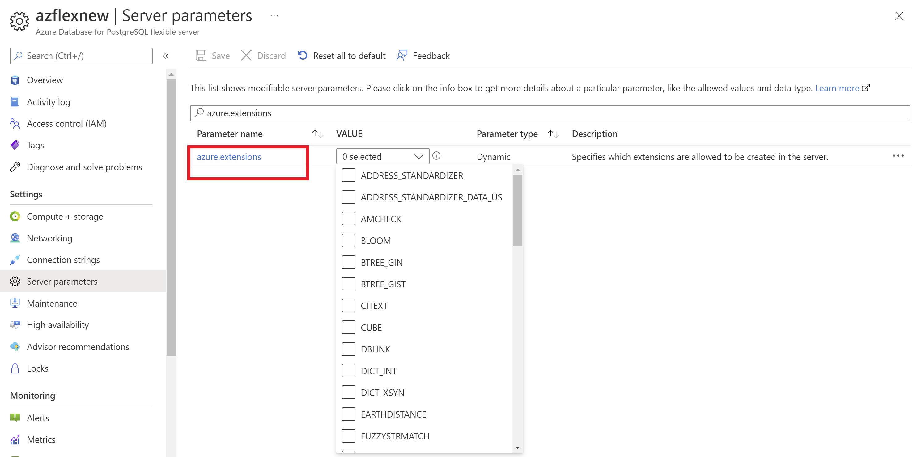

## Join tables from different databases

One of the options is `dblink` extension.

To install extension:
```
CREATE EXTENSION IF NOT EXISTS dblink;
```

Check that extension is installed and test connection to database:
```
SELECT * FROM pg_extension;
SELECT pg_namespace.nspname, pg_proc.proname 
FROM pg_proc, pg_namespace 
WHERE pg_proc.pronamespace=pg_namespace.oid 
   AND pg_proc.proname LIKE '%dblink%';
SELECT dblink_connect('host=localhost user=postgres password=enjoy dbname=postgres');
```

Query to join tables form different databases:
```
SELECT ur."UserId", u."Email", l."LicenseId", ur."SiteId" from public."UserRoles" ur
left join public.dblink('host=hub-p3-psql-prod-gwc-metadata-001.postgres.database.azure.com dbname=Tenants user=<user> password=<password>','SELECT "SiteId", "LicenseId" FROM public."SiteLicense"') AS l("SiteId" uuid, "LicenseId" text)
on ur."SiteId" = l."SiteId"
left join public."Users" u
on ur."UserId" = u."Id"
```

## Azure specific

To allow `dblink` (or whatever) extension in Azure Database for PostgreSQL (Flexible Server) one needs to add this extension in allowlist in Server Parameters.




References:

* [How to use (install) dblink in PostgreSQL?](https://stackoverflow.com/questions/3862648/how-to-use-install-dblink-in-postgresql)
* [Join tables from different databases (PostgreSQL)](https://stackoverflow.com/questions/48475220/join-tables-from-different-databases-postgresql)
* [PostgreSQL extensions in Azure Database for PostgreSQL - Flexible Server](https://learn.microsoft.com/en-us/azure/postgresql/flexible-server/concepts-extensions)